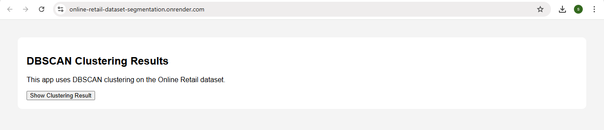
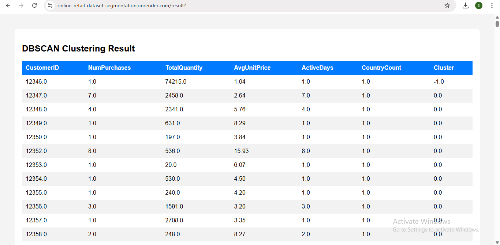

# Online-Retail-dataset-segmentation

This project applies **DBSCAN clustering** to the Online Retail dataset to group customers based on purchasing behavior. A Flask web app is built to display the clustering results in a user-friendly format. The entire application is ready for deployment on Render.

---

## Features

- Customer Segmentation using DBSCAN to identify patterns in retail purchasing behavior.
- Automated Preprocessing: Cleans, aggregates, and scales data for clustering.
- Flask Web Interface to display clustered customer data in a structured table.
- Deployable on Render with Gunicorn and production-ready setup (Procfile, requirements.txt).
- Interactive Templates with clean HTML/CSS styling for easy interpretation of results.

---

## Prerequisites

Make sure the following are installed:

- Python 3.7 or higher installed
- Git installed and configured
- Basic knowledge of Python and Flask
- A GitHub account (for code hosting)
- Render account (for deployment)

---

## Installation

### 1. Clone the repository

```
git clone https://github.com/sandhiya0147/Online-Retail-dataset-segmentation.git
cd Online-Retail-dataset-segmentation
```

### 2. Install dependencies

```
pip install -r requirements.txt
```

---

## Running the Application

Start the Flask development server:

```
python app.py
```

Then open your browser and go to:

```
http://127.0.0.1:5000
```

---

## How It Works

- Data Loading: Reads the Online Retail.xlsx dataset and filters out invalid entries.
- Feature Engineering: Aggregates customer-level metrics like purchase count, quantity, and average price.
- Preprocessing: Scales the features using StandardScaler to prepare for clustering.
- Clustering: Applies the DBSCAN algorithm to group similar customers and detect outliers.
- Web App: A Flask application displays the clustered results through an HTML interface.

---

## File Structure

```
Online-Retail-dataset-segmentation/
├── assets/                     
│   ├── segmentation.png
│   ├── summary.png
│
├── static/                      
│   └── style.css
│
├── templates/                   
│   └── index.html
│
├── Iris.csv                     
├── Procfile                     
├── README.md                    
├── app.py                       
├── model.pkl                    
├── model_train.py              
├── requirements.txt             
└── target_names.pkl             
```

---

## Future Improvements

- Add Prediction Interface – Let users input new customer data to predict cluster membership (if applicable).
- Visualizations – Include cluster plots using PCA or t-SNE for better understanding of group separation.
- Dynamic Filtering – Allow filtering by cluster ID, country, or purchase volume in the web interface.
- Model Comparison – Add KMeans, Agglomerative, and other clustering models for comparative analysis.
- Real-Time Data Support – Extend the app to process and cluster real-time retail transaction data.

---


## Step-by-Step Guide: How to Use the Movie Interest Predictor


### Step 1: Input Form
  

### Step 2: Filled Form 
  

---

## Live Demo

[Click here to view the deployed app](https://online-retail-dataset-segmentation.onrender.com)

---
